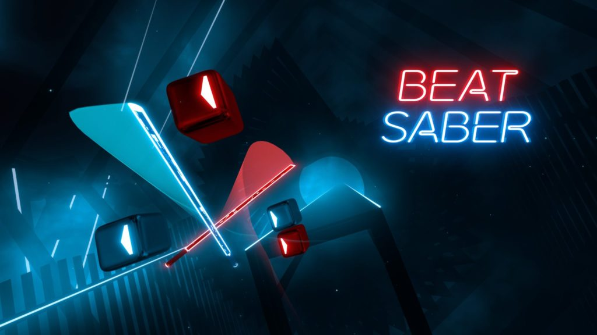

Beat Saber
==========

Beat Saber is virtual reality rhythm game in which the player slashes sabers
through beat blocks in time with the music. While the game can be played offline
and without mods, the player can download custom song maps from the community
to expand the variety of music and challenge their skills.



    *Beat Saber* [#f1]_

How to play?
------------

#. You must have a virtual reality headset and controllers to play Beat Saber.
#. Stretch your body and clear your play area.
#. Purchase Beat Saber from your preferred game store that is compatible with your headset.
#. Navigate through the song selection screen to pick your favorite song.
#. Once the song is loaded, swing your sabers through the beat blocks in time with the song.

    * You must cut through the blocks in the direction of the arrow on each block.
    * Blocks with a dot in the center can be cut in any direction.

#. Avoid cutting mines as they will end your song and cause you to fail.
#. Move your body to keep your head out of the large blowing boxes.

    * These are head obstacle and will cause you to fail in you are in them for too long.

The Community
`````````````

As you improve your Beat Saber skills, the game community has many higher difficulty and high variety
music and song maps available to download.

Importing these into the game allows you to grow as a player and
enjoy your favorite music or memes in a fantastic game environment.

.. [#f1] Graham, Peter. "Charity Beat Saber Tournament Beat Master Taking Place in 2020, Registrations Now Open." VRFocus, March 22, 2019. https://www.vrfocus.com/2019/03/charity-beat-saber-tournament-beat-master-taking-place-in-2020-registrations-now-open/.