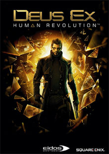
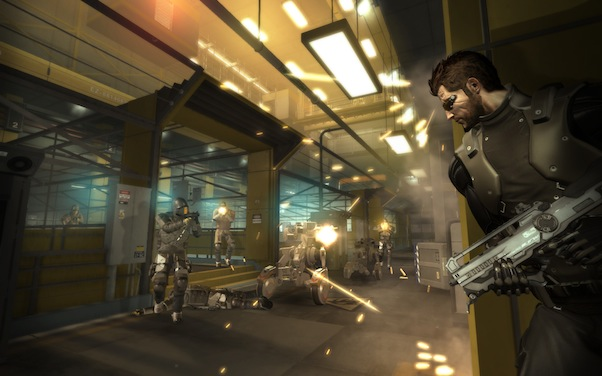

Deus Ex: Human Revolution
=========================

This game is something else. It's certainly an
interesting subject for me, being a sequel to what is
simply my favorite game ever made: The original
*Deus Ex*, released back in 2000. Deus Ex: Human Revolution
was released by Square Enix in 2007 to critical acclaim.
To this day, it's still an extremely well regarded action
RPG, commonly praised for allowing the player to chose
a variety of ways to approach or even circumvent any
situation they come across.

*Game Boxart* [1]_

The frequent praise you'll typically hear surrounding this
game follows the idea of: *You can fight, sneak, or talk
your way through any encounter*, and this praise is
certainly well-earned. Human Revolution is very good at
making sure no matter where you are or what you're doing,
there's multiple ways to do it. This is always something
I appreciate in games, having that level of agency as
to how I want to solve a problem always tickles my brain.
It notoriously falls flat once you get to the boss fights,
which essentially follow the age-old principle of "shoot
it until it dies", but this was later fixed in the
Director's Cut re-release.

*Game Screenshot* [1]_

Although, having played the original Deus Ex, I can't
help but notice some of the game's shortcomings. Although
it's more consistent about what options it gives you, and
it's certainly more polished, I still feel the original
wins out on level design. The original felt like wide
open choice sandboxes, whereas this game feels like
you go through a linear series of choice junctions.

Despite this, Human Revolution is still a great game
by any metric. 7.5/10

.. rubric:: Footnotes

.. [1] https://en.wikipedia.org/wiki/Deus_Ex:_Human_Revolution
.. [2] https://www.ifc.com/2011/06/deus-ex-human-revolution-getti