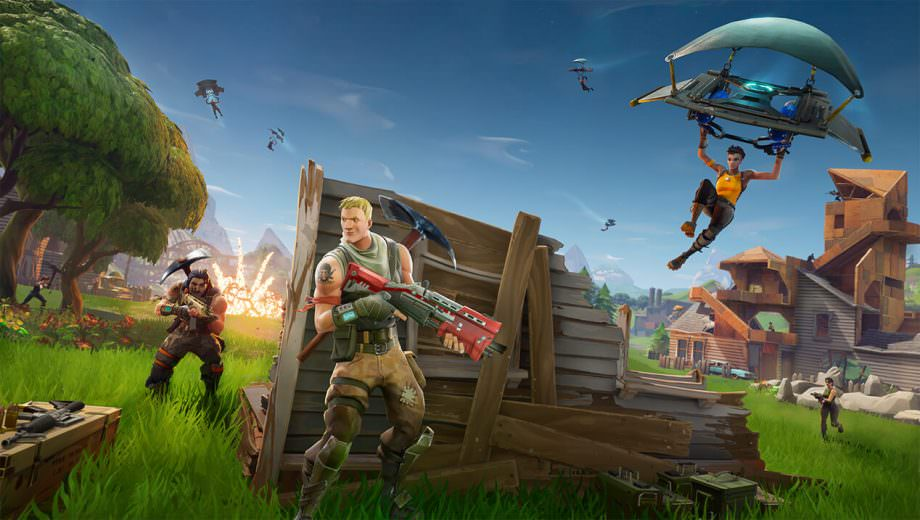

Fortnite
========

Fortnite is a free-to-play third-person battle-royale. Up to 100 people
participate in a match together. Players are dropped onto the game map and
must compete to be the last one standing by killing every other player in
the game. During the game, players collect weapons, build safe structures,
and try to avoid the Storm that damages all players outside of a safe zone.

How to play?
---------------------

Step 1: Pick a landing spot.

Step 2: Jump out of the battle bus.

Step 3: Nail your landing.

Step 4: Find weapons and ammo.

Step 5: Harvest some materials to build with.

Step 6: Check if anyone has landed near/with you.

Step 7: Eliminate everyone in the area.

Step 8: Hunt down the rest of the lobby.

Step 9: Eliminate everyone else in the lobby and bam Victory Royale!

Fortnite Rating
---------------

Fortnite is a very fun game to play with friends and have fun together on.
However, there are a lot of sweaty players who play the game now and are
competing to be the best players in the world. A lot of these players you
will find in your own lobbies and they will destroy you. Most of these
players ruin all your fun and are too busy trying to sweat. Our rating for
Fortnite is a 7/10.