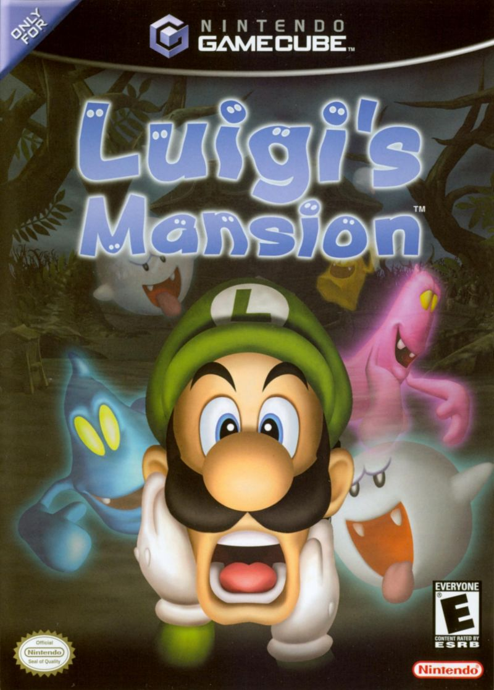

Luigi's Mansion
===============
*Page author: Ean Warrick*

What is Luigi's Mansion?
------------------------

Luigi's Mansion is a game developed by Nintendo for the GameCube and was released on
september 14, 2001. It was the first game to have Luigi as the sole starring role.
At the start of the game it is let known to the player that Luigi has won a mansion
in a contest he didn't even enter. He let his brother Mario know and planned
to meet him at the mansion. Mario was suppose to get there first, but when Luigi
enters the mansion, Mario is nowhere to be seen! It's up to mario to figure out
what happened to Mario, and rescue him!

Controls
--------
The following show the controls for Luigi's Mansion on a GameCube controller.

================== =======================
Control            Action
================== =======================
Top-Left Joystick   Move Luigi
A Button            Interact/Open Doors/Yell
B Button            Turn off flashlight
C-Stick             Rotate Luigi/Aim Vacuum
X Button            GameBoy Horror
Y Button            Map
Right-Trigger       Activate Vacuum (Suck)
Left-Trigger        Activate Vacuum (Blow)
Z-Button            Items menu
Start               Pause menu
================== =======================

Secret Mansion
---------------

After beating the game, if you go to professor E. Gadd he will have another option
called "Secret mansion". The secret mansion looks exactly like the normal one. There are
differences, however. Luigi's vacuum has more power than normal, but ghosts have more health
and deal more damage to Luigi. Boo's run away much faster when being chased. There is more cash
in this mansion, letting luigi be able to achieve the game's A rank that's rewarding when beating
the game with a certain amount of cash. In the PAL version of Luigi's mansion, the secret
mansion is mirrored.