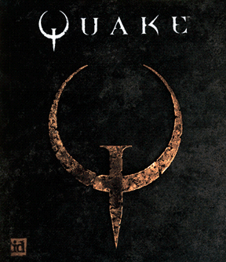
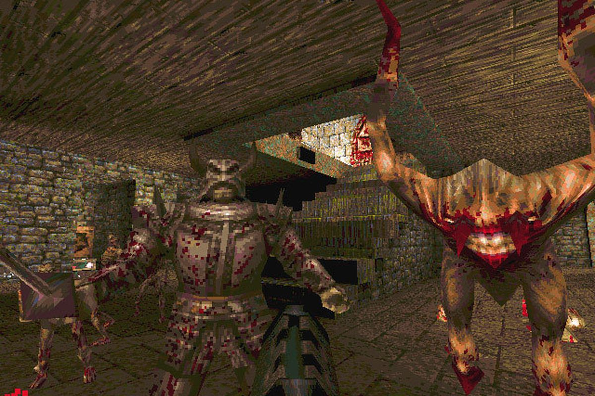

Quake
=====

*Page author: Michael Andros McGee*

If you wanna talk about genre-defining first person
shooter games, Quake is certainly a good contender.
While its predecessor, Doom, from 1993 was arguably a
lot more formative, this certainly was what cemented the
concept as an actual genre.

*Quake's Boxart* [1]_

That said, coming out in 1996, it certainly is showing
its age in some regard, especially visually. Every enemy
in the game looks like they’re made of papercraft or
something. But even despite all of the technical
limitations, a lot of people will tell you the game’s
atmosphere still holds up. Everything about the game’s
environments to their enemy design is very Lovecraft
inspired, and tries to constantly fill you with this
sense of dread, loneliness, and oppression. This is
backed with the game’s soundtrack, composed by Trent
Reznor of NiN. Although most of it isn’t exactly music…
it’s more… droning ambient spooky noise. But it’s good
spooky noise.

The gameplay also holds up fairly well for the most
part. It’s the same-fast paced action shooter that
reflects the formula set by Doom. Run around at
blindingly fast speeds, shoot all the baddies with a
shotgun, grab keys, leave. Although perhaps Doom has
aged a bit better in this regard. It’s very obvious
they had to make the enemies bullet sponges because
they couldn’t place as many enemies in a stage without
the framerate dipping.

*Game Screenshot* [2]_

The Quake franchise has also become rather famous for
its multiplayer aspect. It had a much better netcode
than Doom, and much more refined movement controls, so
deathmatch for the game became very popular. In fact,
the original Team Fortress actually started as a
modification of Quake 1.

In sum, there are aspects of it that have tarnished with
age, **but it’s still a must-play for anyone who enjoys
shooter games.** 8/10

.. rubric:: Footnotes

.. [1] https://knowyourmeme.com/photos/1126170-quake
.. [2] https://www.polygon.com/2016/6/22/12005460/quake-20th-anniversary-john-romero