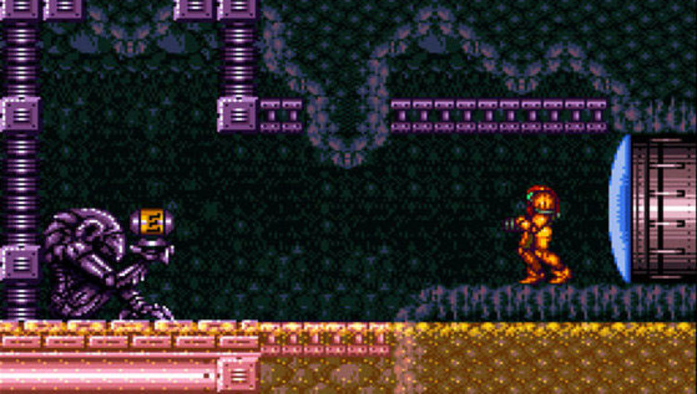

Super Metroid
=============

*Page author: Michael Andros McGee*

Super Metroid was published by Nintendo in 1994, and is
universally credited as being one of the defining titles
of the Metroidvania genre. A lot of newer generations
will tend to overlook a game like this because it’s old,
but let me tell you: I played this game just a few weeks
ago, and honestly… Super Metroid has quickly became one
of my favorites.

.. image:: super_metroid_cover.jpg
    :width: 90%

*Super Metroid's Boxart* [1]_

You play as bounty hunter Samus Aran. (The bounty hunter
part is kinda irrelevant, she’s not even working for
money in this game.) She’s tasked with going to planet
Zebes to stop the legion of Space Pirates after stealing
the last member of a dangerous alien species called
“metroids.” They want to clone them because of… reasons.
Space Pirates are evil, metroid bad, stop the bad guys.
The plot is rather bare bones, and a lot of it is told
in the manual. This was done intentionally so that it
can keep the story minimal and told mostly through
subtext. It’s a trade off.

Anyway, most of what you’re going to be doing in this
game is running around exploring so you can find tools
to help you explore more. This is basically the crux of
the Metroidvania genre. You find items that allow you to
access more of the gameworld, and this cycle repeats
itself adneaseum until the game is over. And this cycle
of exploration is certainly very well done. It
frequently feels like there’s a new secret around every
corner, and it’s always enjoyable to trace back over old
areas with new abilities to see what else you can find.
Most memorably, however, is the fact that the game
allows you to break the intended sequence and get new
powerups early. (Another added benefit of the bare bones
story is that doing this does not make the game collapse
under its own weight)

*Game Screenshot* [2]_

Equipment items
~~~~~~~~~~~~~~~

=============== ===========================================
Item            Description
=============== ===========================================
Morph Ball      Allows you to curl up into a ball and
                reach small areas

Missiles        Explosive weapons that can break open
                certain doors

Super Missiles  Upgraded form of the Missiles

Bombs           Special explosive designed for the
                Morph Ball

Hi-Jump boots   You jump high. Who woulda thunk it.

Varia Suit      Allows you to withstand hot environments

Speed Booster   After running long enough, Samus can now
                bolt through everything in her path

Ice beam        Freezes enemies

Power Bombs     Screen-clearing nuke item

Grapple Beam    Electrical grappling hook item

Wave Beam       Shoots through walls

Gravity Suit    Allows Samus to move unhindered in water

Space Jump      Gives the player literally infinite jumps

Screw Attack    Allows Samus to deal massive damage simply
                by jumping into enemies
=============== ===========================================

Overall, if you have the patience to push through even if
the way forward isn’t always clear, then I would highly
recommend trying Super Metroid. 10/10.

.. rubric:: Footnotes

.. [1] https://www.nintendo.co.uk/Games/Super-Nintendo/Super-Metroid-279613.html
.. [2] https://www.syfy.com/syfywire/snes-classics-come-to-switch-nintendo-direct