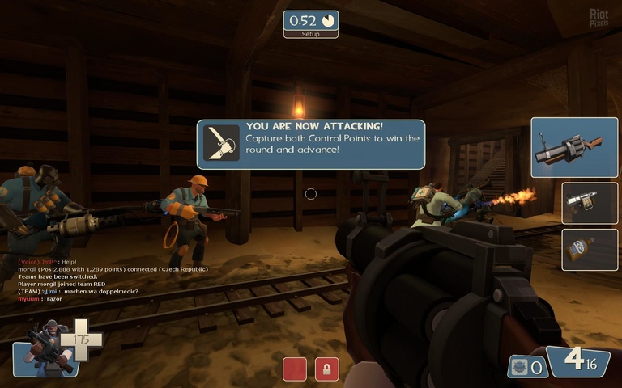

Team Fortress 2
===============

*Page author: Michael Andros McGee*

Team Fortress 2 (commonly abbreviated as TF2) is a
multiplayer first-person shooter released by Valve
Software in 2007, and the community for it is still
going strong today. As the name would imply, the game
revolves around teams, Red and Blue, tasked with
capturing control points. Each team has nine mercenaries
the player can choose from: Scout, Soldier, Pyro,
Demoman, Heavy Weapons Guy, Engineer, Medic, Sniper,
and Spy.

.. image:: team_fortress_cover.jpg
    :width: 60%

*Team Fortress 2's Steam Banner* [1]_

- Scout is a light-weight glass cannon character.
  He can do a lot of damage by getting in close with his
  Scattergun, and he also captures twice as fast as any
  other class.

- Soldier is an easy pick for any scenario. He
  roams around with a rocket launcher and can be a
  consistent heavy damage dealer, although he does
  take some practice. A player can also propel
  themselves great distances by shooting rockets at
  their own feet. And yes, you do survive this. Usually.

- Pyro runs around with a flamethrower and throws
  flames. Not much more to ‘em.

- Demoman can lob grenades around, or set traps with
  his sticky bomb launcher. A prime choice for any
  kind of crowd control.

- Heavy is a human tank. He has the most health out
  of any class by a wide margin, and can mow down
  enemies with a powerful minigun.

- Engineer is the ultimate choice for anything
  requiring area denial. He can build stationary
  sentry guns, health and ammo dispensers, and even
  teleporters for additional team support. Any defense
  team worth their salt should have at least one of
  their sentries ready to go.

- I think you can guess what the Medic does.

- Same with Sniper.

- Spy is a bit more complicated. His actual weaponry
  is very situational, but he makes up for it with his
  multitude of tactical options. He can disguise as
  any merc from the opposing team, as well as
  temporarily become invisible at a moment’s notice.
  He can also sabotage engineer’s buildings, and most
  importantly, use his knife to backstab enemies.

*Game Screenshot* [2]_

Combine all this with the fact that every character has
a huge host of unlockable weapons that change their
playstyle, and you have yourself a game that is prime to
be replayed for years upon end. I’ve easily spent more
hours with this game than I have any other.

Also there’s hats.

9.5/10

.. rubric:: Footnotes

.. [1] https://store.steampowered.com/app/440/Team_Fortress_2/
.. [2] http://en.riotpixels.com/games/team-fortress-2/screenshots/292/
