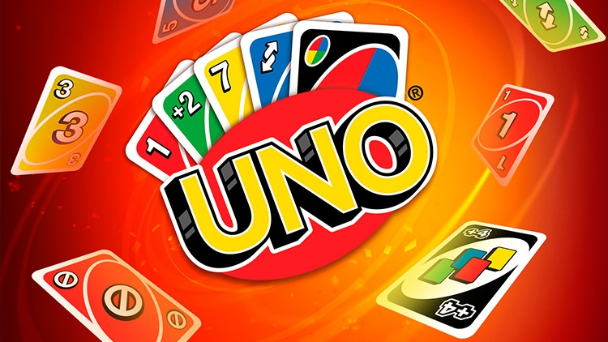

UNO
===

Players take turns matching a card in their hand with
the current card shown on top of the deck either by color or number.
Special action cards deliver game-changing moments as they help you
defeat your opponents. These include Skips, Reverses, Draw Twos, Wild
and Draw Four Wild cards. You’ll find 25 of each color (red, green,
blue, and yellow), eight Wild cards, three Customizable cards and one
Special Rule card inside the 112-card deck. If you can’t make a match,
you must draw from the central pile! And when you’re down to one card,
don’t forget to shout “UNO!” The first player to rid themselves of all
the cards in their hand before their opponents wins.
